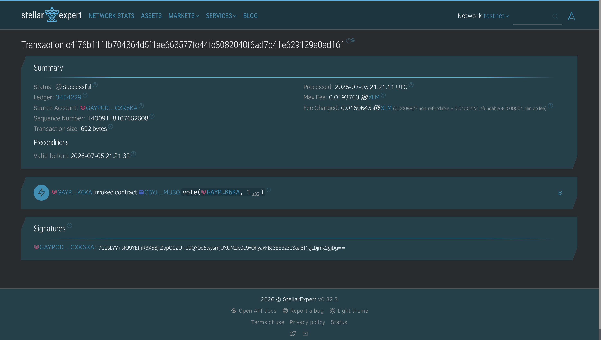
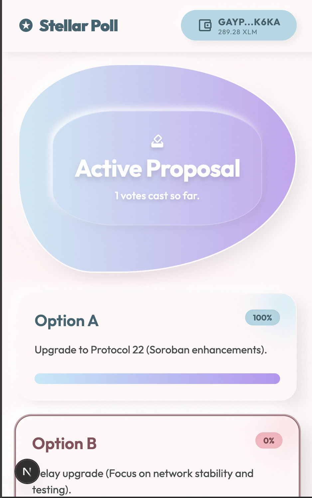
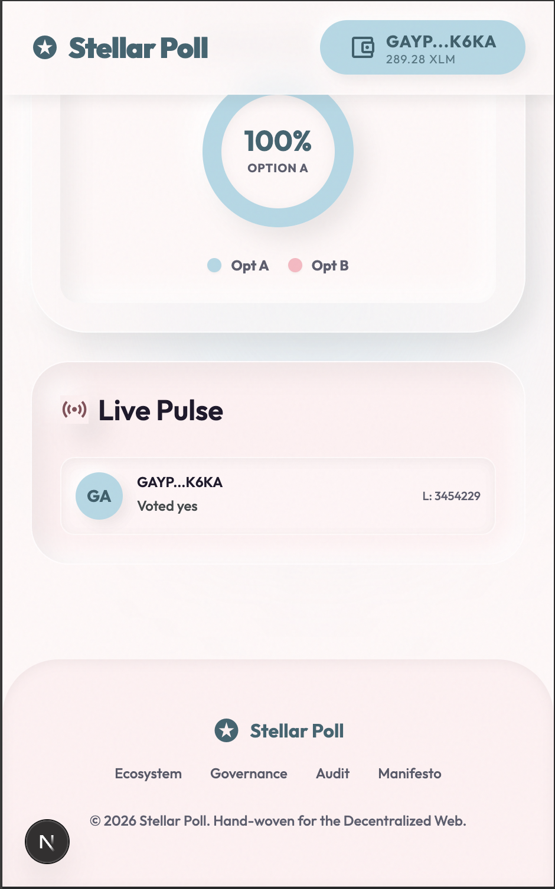

<div align="center">
  
  
  <h1 align="center">Stellar Live Poll</h1>
  
  <p align="center">
    <strong>A decentralized real-time polling application powered by Soroban Smart Contracts.</strong>
  </p>

  <p align="center">
    <a href="#challenge-submission-checklist">Challenge Submission</a> •
    <a href="#required-links--information">View Contract</a> •
    <a href="#local-setup-instructions">Get Started</a>
  </p>
</div>

---

## 📖 Project Description

Stellar Live Poll is a modern, decentralized real-time polling application built to demonstrate the capabilities of the Stellar network. By combining Next.js with a Soroban Smart Contract deployed on the Stellar Testnet, users can seamlessly connect their wallets, cast immutable votes on-chain, and watch poll results update automatically in real time with beautiful fluid animations.

## ✨ Key Features

- **Multi-wallet Integration:** Securely connect and manage sessions using `@creit.tech/stellar-wallets-kit` (Supports Freighter, xBull, and Lobstr).
- **On-chain Voting:** Votes are cast directly on the Stellar Testnet via a custom Soroban smart contract.
- **Real-time Synchronization:** Poll results are instantly fetched and rendered, providing immediate feedback via a live pie chart and progress bars.
- **Premium UX/UI:** Fluid result visualization and micro-interactions powered by CSS and Tailwind CSS, featuring a beautiful "Cotton Candy" glassmorphism aesthetic.
- **Transaction Flow:** End-to-end transparent transaction signing, submission, and confirmation with Stellar Expert links.

## 🏆 Challenge Submission Checklist

This project serves as a comprehensive submission for the Stellar White Belt challenge, fulfilling all core criteria:

- [x] **3 error types handled:** The smart contract throws and the UI gracefully decodes `AlreadyVoted`, `PollClosed`, and `InvalidOption`.
- [x] **Contract deployed on testnet:** Custom Soroban contract deployed to Testnet (see below).
- [x] **Contract called from the frontend:** The Next.js frontend calls `vote` and `get_results` natively using Stellar SDK.
- [x] **Transaction status visible:** Animated toasts and activity feeds display on-chain success, pending states, or failure.
- [x] **Minimum 2+ meaningful commits:** Professional, atomic commits executed.
- [x] **Multi-wallet app:** Connected via Stellar Wallets Kit.

## 🔗 Required Links & Information

- **Screenshot of Wallet Options:** 
  
  
- **Deployed Contract Address:** `CBYJ6V4575YKTGRF4J4Q4IHKVYWRROR5F7KKVU4RYVMAMGIKKGAHMUSO`
- **Transaction Hash:** [`7159fdf4b84fdbfcfee335e0264d10c7368d2422592c47d62f36a6913fea31a7`](https://stellar.expert/explorer/testnet/tx/7159fdf4b84fdbfcfee335e0264d10c7368d2422592c47d62f36a6913fea31a7)

## 📸 Visual Walkthrough

### On-Chain Transaction Success


### Mobile Optimized Views
<div style="display: flex; gap: 10px;">
  
  
</div>

## 🏗️ Architecture Overview

The application utilizes a robust client-serverless architecture:
1. **Frontend Layer (Next.js):** Manages local state, animation, and UI rendering.
2. **Integration Layer (Stellar SDK):** Handles contract parsing, XDR encoding, and wallet connection payloads.
3. **Smart Contract Layer (Soroban):** Acts as the immutable backend, permanently storing the total votes and distribution logic on the Stellar blockchain.

## 📂 Project Structure

```text
stellar-live-poll/
├── src/
│   ├── app/           # Next.js App Router and main pages
│   ├── components/    # Reusable modular React components
│   └── lib/           # Stellar SDK integration and constants
├── contracts/         # Soroban Rust smart contract source code
├── public/            # Static assets and icons
├── demo/img/          # Documentation and walkthrough imagery
└── package.json       # Project dependencies and scripts
```

## 🚀 Local Setup Instructions

To run this application locally, ensure you have Node.js installed, then execute the following commands:

```bash
# Install all dependencies
npm install

# Start the development server
npm run dev
```
Navigate to `http://localhost:3000` to interact with the application.

## 🛠️ Technology Stack

- **Framework:** Next.js (React)
- **Language:** TypeScript, Rust (Contracts)
- **Styling:** Tailwind CSS
- **Web3 Integration:** Stellar Wallets Kit, Stellar SDK
- **Network:** Stellar Testnet

## 🛡️ Error Handling

The application has been engineered to handle critical edge cases gracefully:

1. **Wallet Not Installed:** Detects missing wallet extensions and prompts the user to install them.
2. **User Rejects Transaction:** Safely catches `User declined` errors without breaking the application state.
3. **Insufficient Balance:** Specifically captures and notifies users of `tx_insufficient_balance` when attempting to cast a vote without Testnet XLM.
4. **Already Voted:** Prevents spam by identifying when a user's wallet has already cast a vote on the active contract.

## 🔄 Real-Time Synchronization

Instead of requiring manual page refreshes, the application actively polls the Soroban contract state. When the blockchain ledger closes, the UI immediately calculates the new percentage distributions and fluidly animates the pie chart and progress bars to reflect the newly synchronized on-chain reality.

## 📝 License

This project is open-source and available under the [MIT License](LICENSE).
